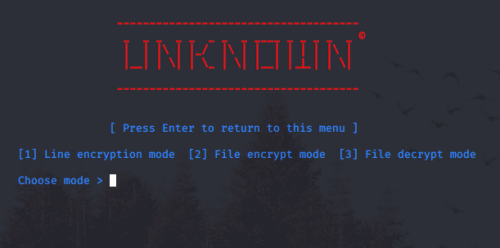

# What's Unknown
As you read in the definition, the Unknown tool encrypts the given file or input using an asymmetric key and, if this is a file, it saves with the .unknown extension, and when it is decrypted, it saves it again with the .known .

## Usage
  Just run and choose your mode. When you want to return main menu just press enter.
  
* Line encryption mode : It creates and encrypts the entered words or numbers in a unique asymmetric key.
* File encryption mode : It encrypts the given file with a ready asymmetric key.
* File decryption mode : It decrypts the given file with a ready asymmetric key.

